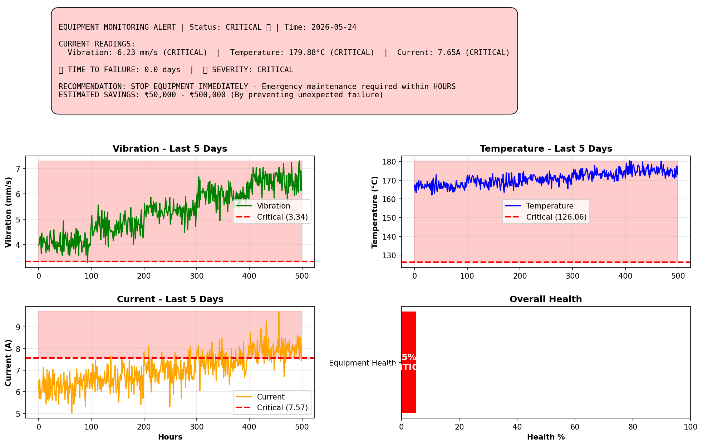
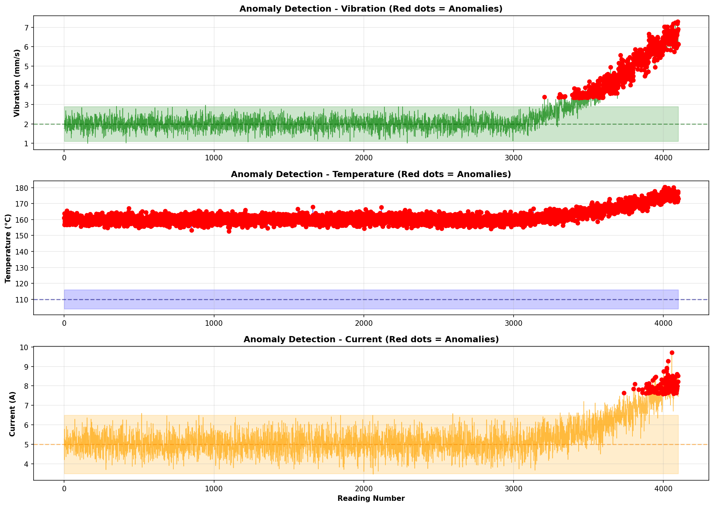

markdown# 🚨 PREDICTIVE MAINTENANCE SYSTEM

> **Predict Equipment Failure Before It Happens | Save ₹50,000 - ₹500,000**

---

## 💥 THE PROBLEM

Your equipment breaks at the WORST possible time.
Day 1:  Machine working fine ✅
Day 2:  Machine working fine ✅
Day 3:  Machine working fine ✅
Day 4:  CRASH! 💥
Cost: ₹50,000 - ₹500,000 LOST
Downtime: Hours or Days
Customer: ANGRY 😠

---

## 🎯 THE SOLUTION

**Predict equipment failure BEFORE it happens.**
Day 1:  Machine working fine ✅
Day 2:  Machine working fine ✅
Day 3:  Machine working fine ✅
Day 4:  🔴 ALERT: Failure in 24 hours
→ Schedule maintenance NOW
→ Replace part BEFORE breakdown
→ Zero downtime ✅
→ Customer HAPPY 😊

---

## 📊 LIVE EXAMPLE OUTPUT

### Equipment Monitoring Alert
============================================================
⚙️  EQUIPMENT MONITORING DASHBOARD
Equipment: Motor_#3 | Status: CRITICAL 🔴 | Time: 2026-05-24
SENSOR READINGS:
• Vibration: 6.23 mm/s (CRITICAL - Above 3.34)
• Temperature: 179.88°C (CRITICAL - Above 126.06)
• Current: 7.65A (CRITICAL - Above 7.57)
⏰ TIME TO FAILURE: 0.0 days (FAILING NOW!)
🚨 SEVERITY: CRITICAL 🔴
RECOMMENDATION: STOP EQUIPMENT IMMEDIATELY
ESTIMATED SAVINGS: ₹50,000 - ₹500,000

### Real-Time Alerts
🔴 VIBRATION CRITICAL: 6.23 mm/s (threshold: 3.34)
🔴 TEMPERATURE CRITICAL: 179.88°C (threshold: 126.06)
🔴 CURRENT CRITICAL: 7.65A (threshold: 7.57)
ACTION: IMMEDIATE ⚡ Stop equipment and schedule emergency maintenance
RISK: Equipment failure imminent (< 1 hour)
COST: Prevent ₹50,000+ loss if acted NOW

---

## 📈 VISUALIZATION OUTPUTS

### Dashboard Screenshot


### Anomaly Detection Visualization  


---

## 🚀 HOW IT WORKS

### Phase 1: Learn Normal Behavior
Input: 30 days of healthy equipment data
Output: Normal vibration, temperature, current patterns

### Phase 2: Detect Anomalies
Real-time monitoring of sensor data

Vibration spike? ⚠️
Temperature rising? ⚠️
Unusual current draw? ⚠️
ANOMALY DETECTED 🔴


### Phase 3: Predict Failure Time
Current trend: Degrading at 0.5mm/s per day
Critical threshold: 6.5mm/s
PREDICTION: Equipment fails in 12 days

### Phase 4: Alert & Recommend Action
🚨 CRITICAL ALERT
Motor #3 | Status: CRITICAL 🔴
Time to failure: 12 hours
Recommendation: STOP & REPLACE IMMEDIATELY
Estimated savings: ₹200,000

---

## 💼 REAL BUSINESS IMPACT

| Scenario | Without System | With System | Savings |
|----------|---|---|---|
| **Factory Downtime** | Unexpected 12 hours | Planned 2 hours | 10 hours saved |
| **Equipment Loss** | ₹500,000 replacement | ₹50,000 part replacement | ₹450,000 saved |
| **Customer Impact** | Order cancelled | Order on-time | ∞ trust |
| **ROI** | 0% | 300-500% | Year 1 |

---

## 🏭 WHO NEEDS THIS?

✅ Manufacturing Plants
✅ Data Centers  
✅ Robotics Companies
✅ Drone Manufacturers
✅ Power Plants
✅ Airlines/Railways
✅ EV Companies

**If your equipment can break and cause loss → You need this.**

---

## 💡 THE MAGIC

### Statistical Anomaly Detection
```python
z_score = (current_reading - mean) / std_dev
if z_score > 3:
    ALERT: ANOMALY DETECTED
```

### Trend Analysis & Prediction
```python
if degradation_rate > 0:
    time_to_failure = (critical - current) / rate
    ALERT: Failure in {time_to_failure} days
```

---

## 🛠️ TECHNOLOGIES

- **Python 3.x** - Core logic
- **NumPy** - Statistical analysis
- **Matplotlib** - Visualization
- **Scipy** - Signal processing
- **Pandas** - Data manipulation

---

## 💰 PRICING & ROI

### Deployment Options
- **Small Factory**: ₹50,000 - ₹100,000
- **Medium Plant**: ₹100,000 - ₹300,000  
- **Enterprise**: ₹300,000 - ₹1,000,000+

### Recurring Revenue
- Monthly monitoring: ₹5,000-10,000/machine
- Annual maintenance: ₹50,000-100,000
- Upgrades: ₹20,000-50,000

---

## 📞 HIRE ME

**Need predictive maintenance for your equipment?**

I build custom systems for:
- Manufacturing plants
- Data centers
- Robotics companies
- Power infrastructure
- Any equipment that breaks

**Budget: ₹50,000 - ₹1,000,000+**

---

## 🎯 WHY ME?

✅ I understand the problem
✅ I build custom solutions  
✅ I deliver working code
✅ I stay available for support
✅ I'm young & hungry - will execute

---

## 📚 What's Inside

- `anomaly_detection_system.py` - Core algorithm
- `generate_outputs.py` - Visualization generator
- Complete working examples
- Real-world use cases

---

## ⚡ THE BOTTOM LINE

**Unexpected equipment failure costs ₹500,000+**

**This system costs ₹50,000-300,000**

**ROI: 300-500% Year 1**

**Why wait for the next breakdown?**

---

**Built with ❤️ by Anasullah Khan**

*Making equipment smart. Making factories unstoppable.*

---

## 🚀 READY TO STOP LOSING MONEY?

**Contact me today.**

Email:anaskhan3399933@gmail.com | GitHub: github.com/anasullahkhan

---

## Author

**Anasullah Khan**
- B.Tech AI & ML @ JPNCE, Telangana
- Specializing in Predictive Maintenance & Anomaly Detection

## License

MIT
